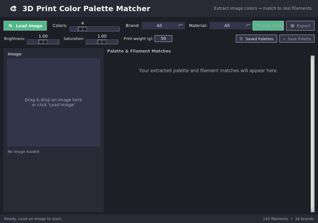

# 🎨 3D Print Color Palette Matcher

[](../../actions/workflows/build.yml)
[](LICENSE)
[](https://www.python.org/)
[](#-download)
[](CONTRIBUTING.md)

A cross-platform desktop app that extracts the dominant colors from any image
(or takes colors you type in directly) and matches them to **real-world 3D
printing filament colors** from popular brands — then tells you **where to buy
them** and **how much the print will cost**, plans your **filament slots**, and
even shows a **preview of your image in the matched filament colors**.

Perfect for planning multi-color prints on **Bambu Lab AMS (4 / 8 / 16 color),
Prusa MMU3, tool changers / multi-head, IDEX / dual extruder**, and other
multi-material systems (or plain manual filament swaps).



---

## 📥 Download

**No Python? No problem.** Get the app in seconds:

### 🪟 Windows (recommended — installer with desktop icon)
1. Go to [**Releases**](../../releases) and download **`3DColorPaletteMatcher-Setup.exe`**.
2. Run the installer — it will:
   - 🖥️ Create a **desktop icon** (with the custom app logo)
   - 📂 Add a **Start Menu** shortcut
   - 🗑️ Register an **uninstaller** in Settings → Apps (a.k.a. "Programs and Features")
3. No admin password needed (installs per-user).

### 🍎 macOS / 🐧 Linux / 🪟 Windows Portable
Download the standalone executable for your OS from [**Releases**](../../releases):
- **Windows** → `Portable-Windows.exe` (runs directly, no install)
- **macOS** → `Portable-macOS`
- **Linux** → `Portable-Linux`

Double-click to run. No install needed! 🎉

> All builds are produced automatically by GitHub Actions and include the custom icon + working purchase links.  
> Prefer to run from source? See [Installation](#-installation).

---

## ✨ Features

- 🖼️ **Load images** via **Browse** or **drag-and-drop** (JPG, PNG, BMP, GIF, TIFF, WEBP).
- 🎨 **Enter colors directly** — paste/type hex codes or use a color picker, no image needed.
- 🎯 **Dominant color extraction** using **k-means clustering** (NumPy — no heavy ML deps).
- 🎚️ **Configurable palette size** — extract **1 to 16 colors** (great for 8/16-slot AMS).
- 🌈 **Brightness & saturation sliders** to fine-tune extracted colors before matching.
- 🧵 **Big filament database** — **225+ filaments across 16 brands**
  (Bambu Lab, Hatchbox, Prusament, eSun, Polymaker, Overture, SUNLU, ColorFabb,
  MatterHackers, Atomic Filament, IC3D, Amazon Basics, Inland, Elegoo, Creality,
  3D Solutech) covering **PLA, PETG, ABS, TPU, Silk, Matte and Wood**.
- 👁️ **Perceptual color matching** with **CIEDE2000 Delta E** — the industry-standard
  color-difference formula (much closer to how the human eye sees color than CIE76).
- 🥇 **Top-3 match suggestions** per color with a quality rating (perfect → approximate).
- 🔎 **Filter by brand and/or material** to match only filaments you can actually buy.
- 🖨️ **Print System Planner** — assigns your colors to filament slots for
  **Bambu AMS (4/8/16), Prusa MMU3 (5), tool changers / multi-head (up to 8),
  IDEX / dual (2), or manual swaps**, with purge-waste guidance per system.
- 🖼️ **Filament preview** — re-renders your image using the matched filament colors
  so you can see roughly how the print will look (and save the preview as an image).
- 💰 **Filament cost calculator** — estimates grams and cost per color for your print weight.
- ⭐ **Save & reload favorite palettes** between sessions.
- 🛒 **Clickable purchase links** — jump straight to each filament's product page.
- 📤 **Export** to **JSON, readable TXT, HTML, CSV, GIMP palette (.gpl),
  and a slicer filament config (.ini)** for PrusaSlicer / OrcaSlicer / Bambu Studio.
- 🌙 Clean, modern dark UI.

---

## 📦 Installation

### Option A — Run from source

**Prerequisites**
- **Python 3.8+**
- **Tkinter** — bundled with Python on Windows & macOS. On Linux:
  ```bash
  sudo apt-get install python3-tk
  ```

**Install & run**
```bash
cd 3d_color_palette_matcher
pip install -r requirements.txt
python app.py
```

> `tkinterdnd2` (drag-and-drop) is optional — the app works fully without it.

### Option B — Build your own executable

```bash
pip install -r requirements.txt pyinstaller
pyinstaller build.spec        # or: build_exe.bat (Windows) / bash build_exe.sh
```
The standalone app appears in `dist/`.

---

## 🚀 Usage

1. **Load an image** — click **📂 Load Image** or drag one onto the drop zone.
2. **Choose how many colors** with the **Colors** slider (1–16).
3. *(Optional)* Tweak **Brightness / Saturation**, or restrict by **Brand / Material**.
4. *(Optional)* Enter your estimated **Print weight (g)** for the cost estimate.
5. Click **🔍 Match Colors**.
6. Review swatches, their closest filament matches, and the **cost summary**.
7. Click **Buy ↗** on any match to open its product page.
8. **⭐ Save Palette** to keep it, or **💾 Export** in the format you need.

### Try it with the samples
Generate a few test images and drop them in:
```bash
python examples/make_examples.py
```

---

## 🧠 How it works

| Step | Technique |
|------|-----------|
| Color extraction | K-means clustering (k-means++ init) on downscaled image pixels |
| Adjustment | Optional brightness/saturation tweak in HSV space |
| Color space | sRGB → linear RGB → CIE XYZ (D65) → CIE L\*a\*b\* |
| Color matching | **CIEDE2000 Delta E** (the current CIE standard color-difference metric) |
| Cost | `grams = weight × color%`, `cost = grams/1000 × price_per_kg` |

Matching in **Lab space** with **CIEDE2000** is far more perceptually accurate
than comparing raw RGB values (or even the older CIE76 formula), so the
suggested filaments look correct to the human eye.

**Match quality scale (ΔE2000):**
`≤1 perfect · ≤2 excellent · ≤3.5 great · ≤6 good · ≤10 fair · >10 approximate`

---

## 📁 Project structure

```
3d_color_palette_matcher/
├── app.py                 # Tkinter GUI application
├── color_utils.py         # Color extraction (k-means) + matching (Delta E) + adjust
├── filament_database.py   # Filament colors, prices, brands, URLs
├── cost.py                # Filament cost estimator
├── palette_store.py       # Save / load favorite palettes
├── slicer_export.py       # CSV / GIMP / slicer-config exports
├── build.spec             # PyInstaller build definition
├── build_exe.bat/.sh      # One-click build scripts
├── examples/              # Sample image generator
├── docs/                  # Screenshot & demo GIF
├── .github/workflows/     # CI: auto-build Windows/macOS/Linux executables
└── requirements.txt
```

---

## 🎨 Adding your own filaments

Open `filament_database.py` and add an entry to the `_FILAMENTS` list:

```python
{"brand": "MyBrand", "material": "PLA", "name": "Cool Teal",
 "hex": "#0FB5A8", "url": "https://example.com/product"},
```

The RGB value is derived automatically. Optionally add a price in `_PRICE_PER_KG`.
See [CONTRIBUTING.md](CONTRIBUTING.md) — filament additions are the most welcome PRs!

---

## ⚠️ Notes
- Filament color values and prices are **approximations** for planning, not exact
  reproduction. Always verify against a physical sample or the manufacturer's swatch.
- Purchase links point to product/category pages that may change over time.

## 🤝 Contributing
PRs welcome! See [CONTRIBUTING.md](CONTRIBUTING.md) — especially for adding filament colors.

## 📄 License
[MIT](LICENSE) © 2026 Netspecs
