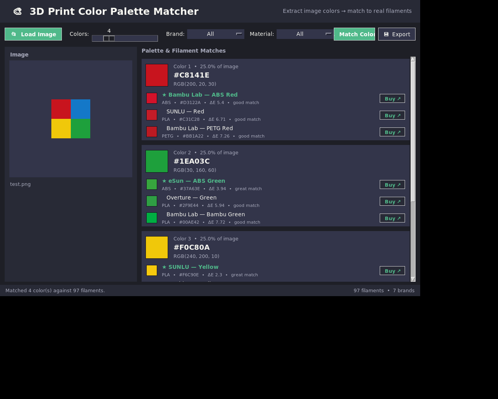

# 🎨 3D Print Color Palette Matcher

A cross-platform Python desktop app that extracts the dominant colors from any
image and matches them to **real-world 3D printing filament colors** from
popular brands. Perfect for planning multi-color prints on **Bambu Lab AMS
(4 / 8 / 16 color), Snapmaker**, and other multi-material systems.



---

## ✨ Features

- **Load images** via a **Browse** button or **drag-and-drop** (JPG, PNG, BMP, GIF, TIFF, WEBP).
- **Dominant color extraction** using **k-means clustering** (NumPy implementation — no heavy ML deps).
- **Configurable palette size** — extract anywhere from **1 to 16 colors** (default 4).
- **Comprehensive filament database** — 90+ filaments across **7 brands**
  (Bambu Lab, Hatchbox, Prusament, eSun, Polymaker, Overture, SUNLU) covering
  **PLA, ABS and PETG**.
- **Perceptual color matching** using **CIE76 Delta E** (matching done in Lab color space, not raw RGB).
- **Top-3 match suggestions** per color with a quality rating (excellent → approximate).
- **Filter by brand and/or material** to match only filaments you can actually buy.
- **Clickable purchase links** — jump straight to each filament's product page.
- **Export** your palette to **JSON, TXT, or HTML**.
- Clean, modern dark UI.

---

## 📦 Installation

### 1. Prerequisites
- **Python 3.8+**
- **Tkinter** — bundled with Python on Windows & macOS.
  On Linux install it if needed:
  ```bash
  sudo apt-get install python3-tk
  ```

### 2. Get the code & install dependencies
```bash
cd 3d_color_palette_matcher
pip install -r requirements.txt
```

> `tkinterdnd2` (for drag-and-drop) is optional. If it's not installed the app
> still works fully — just use the **Load Image** button.

---

## 🚀 Usage

```bash
python app.py
```

1. **Load an image** — click **📂 Load Image** or drag an image onto the drop zone.
2. **Choose how many colors** to extract using the **Colors** slider (1–16).
3. *(Optional)* Restrict results with the **Brand** and **Material** filters.
4. Click **🔍 Match Colors**.
5. Review the extracted swatches and their closest filament matches
   (each shows brand, material, color name, HEX, and ΔE distance).
6. Click **Buy ↗** next to any match to open its product page.
7. Click **💾 Export** to save the palette as JSON, TXT, or HTML.

---

## 🧠 How it works

| Step | Technique |
|------|-----------|
| Color extraction | K-means clustering (k-means++ init) on downscaled image pixels |
| Color space | sRGB → linear RGB → CIE XYZ (D65) → CIE L\*a\*b\* |
| Color matching | CIE76 Delta E (Euclidean distance in Lab space) |

Matching in **Lab space** is far more perceptually accurate than comparing raw
RGB values, so the suggested filaments look correct to the human eye.

**Match quality scale (Delta E):**
`≤2 excellent · ≤5 great · ≤10 good · ≤20 fair · >20 approximate`

---

## 📁 Project structure

```
3d_color_palette_matcher/
├── app.py                 # Tkinter GUI application
├── color_utils.py         # Color extraction (k-means) + matching (Delta E)
├── filament_database.py   # Filament color database (brands, materials, URLs)
├── requirements.txt       # Python dependencies
└── README.md
```

## 🎨 Adding your own filaments

Open `filament_database.py` and add an entry to the `_FILAMENTS` list:

```python
{"brand": "MyBrand", "material": "PLA", "name": "Cool Teal",
 "hex": "#0FB5A8", "url": "https://example.com/product"},
```

The RGB value is derived automatically from the HEX string.

---

## ⚠️ Notes
- Filament color values are **approximations** meant for visual matching, not
  exact color reproduction. Always verify against a physical sample or the
  manufacturer's swatch before buying.
- Purchase links point to product/category pages that may change over time.

## 📄 License
Provided as-is for personal and hobbyist use.
